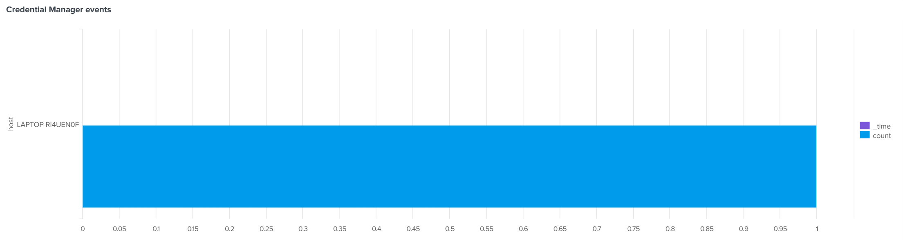
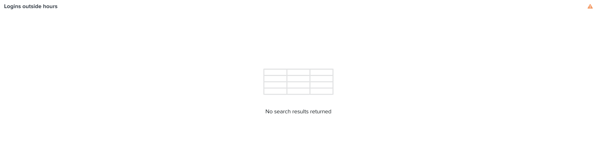

# 🚨 Splunk Security Analysis: Windows Login Monitoring

## 📌 Project Overview
This project demonstrates the use of Splunk to detect and analyze Windows login activities.  
It includes SPL queries for monitoring successful logins, Credential Manager accesses, logins outside normal hours, and hosts with multiple logins.  
The goal is to simulate a real-world SOC workflow for monitoring suspicious authentication activity.

---

> ## Step 1: Event Code Extraction
> **Purpose:** Verify that EventCodes are extracted correctly from the Windows logs.
>
> ```spl
> index=security_logs source="C:\\Users\\yvett\\OneDrive\\Documents\\comptia Security\\CHATGPT\\exiting_sucurity_logs.evtx"
> | rex "EventCode:\\s(?<EventCode>\\d+)"
> | table _time, host, EventCode, _raw
> | head 20
> ```
>
> 

---

> ## Step 2: Count Successful Logins (4624)
> **Purpose:** Count and visualize successful login events (Event ID 4624).
>
> ```spl
> index=security_logs source="C:\\Users\\yvett\\OneDrive\\Documents\\comptia Security\\CHATGPT\\exiting_sucurity_logs.evtx"
> | rex "EventCode:\\s(?<EventCode>\\d+)"
> | search EventCode=4624
> | stats count by host, _time
> | sort -_time
> ```
>
> 

---

> ## Step 3: Credential Manager Access Events (5379)
> **Purpose:** Detect and count Credential Manager logins (Event ID 5379).
>
> ```spl
> index=security_logs source="C:\\Users\\yvett\\OneDrive\\Documents\\comptia Security\\CHATGPT\\exiting_sucurity_logs.evtx"
> | rex "EventCode:\\s(?<EventCode>\\d+)"
> | search EventCode=5379
> | stats count by host, _time
> | sort -_time
> ```
>
> 

---

> ## Step 4: Logins Outside Normal Hours
> **Purpose:** Identify logins during unusual times (before 6 AM or after 9 PM).
>
> ```spl
> index=security_logs source="C:\\Users\\yvett\\OneDrive\\Documents\\comptia Security\\CHATGPT\\exiting_sucurity_logs.evtx"
> | rex "EventCode:\\s(?<EventCode>\\d+)"
> | search EventCode=4624
> | eval hour=strftime(_time,"%H")
> | where hour<6 OR hour>21
> | stats count by host, hour
> | sort -hour
> ```
>
> 

---

> ## Step 5: Hosts with Multiple Logins
> **Purpose:** Detect hosts/accounts with repeated login attempts (possible brute force or automated login).
>
> ```spl
> index=security_logs source="C:\\Users\\yvett\\OneDrive\\Documents\\comptia Security\\CHATGPT\\exiting_sucurity_logs.evtx"
> | rex "EventCode:\\s(?<EventCode>\\d+)"
> | search EventCode=4624
> | stats count by host
> | where count>5
> | sort -count
> ```
>
> 

---

## 🚀 Next Steps
- Extend detection to include **successful logins after multiple failures**.  
- Correlate with **geolocation or threat intelligence** to detect suspicious logins.  
- Automate alerts for repeated failures in a short timeframe.

---

## 👤 Author
**Yvette Menye**  
Cybersecurity Analyst | SOC & Threat Detection Enthusiast
